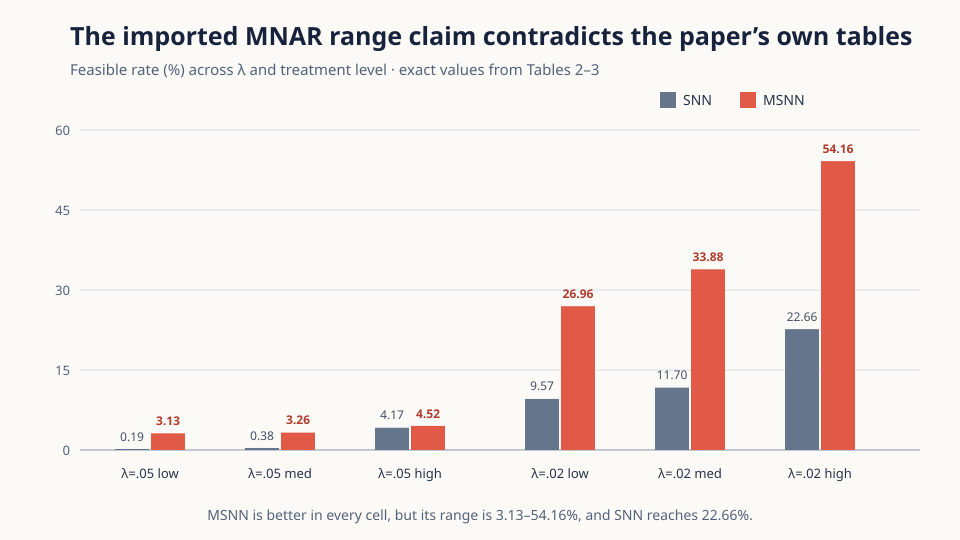
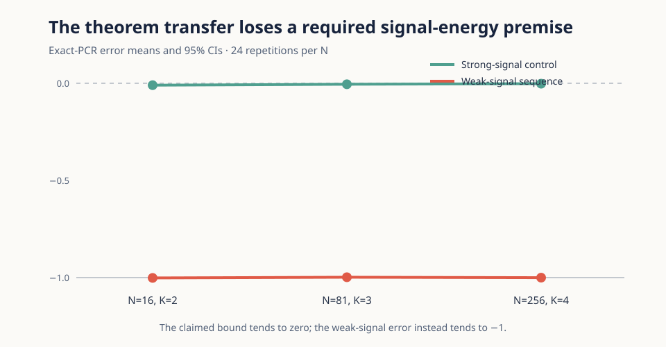
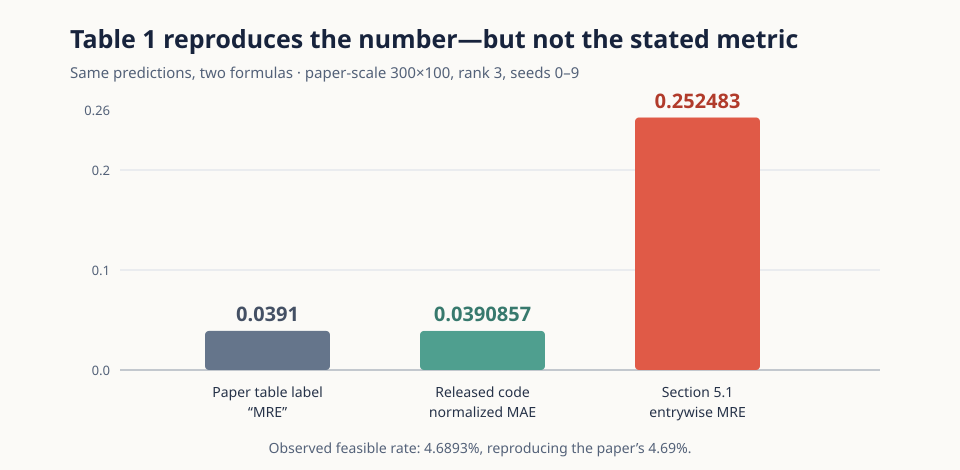
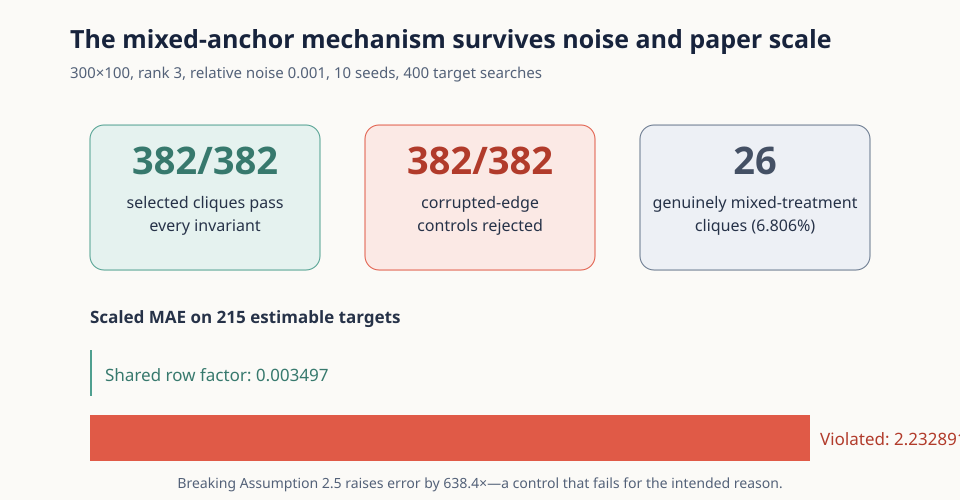

# What survives a claim-by-claim audit of Mixed SNN?



The paper asks whether observations from several treatment levels can be
combined to impute a missing potential outcome without discarding the target
row's same-treatment information. Its proposed Mixed Synthetic Nearest
Neighbors (MSNN) method searches for a treatment-compatible bipartite clique,
then runs principal-component regression on that anchor block.

Our result is deliberately mixed. The combinatorial efficiency identities and
the mixed-anchor implementation withstand direct checks. Three stronger
statements do not: the theorem transfer omits a signal-energy premise from the
SNN theorem it cites, Table 1 labels a released-code normalized MAE as the
paper-defined entrywise MRE, and the imported MNAR range summary conflicts
with Tables 2–3 themselves.

## Evidence at a glance

| Claim | Paper or imported statement | Reproduction result | Verdict |
|---|---|---|---|
| 1 | Theorems 4.5–4.6 preserve SNN finite-sample and asymptotic guarantees | Assumption-satisfying weak-signal sequence has error → −1 while the claimed bound → 0 | **FALSIFIED** |
| 2 | Corollary 4.10 mixed-subgroup gain factor | Exact Laurent-exponent derivation and independent symbolic checker agree | **VERIFIED** |
| 3 | Corollary 4.11 changes sparse/rich order from quadratic to linear | Exact division yields exponents `rc+r+c` versus `r` | **VERIFIED** |
| 4 | Table 1: 4.69% FR and 0.0391 MRE for MSNN at `p(d)=.01` | FR reproduced; `0.0391` is normalized MAE, while stated MRE is `0.252483` | **FALSIFIED** |
| 5 | MNAR: MSNN 3–26%, SNN <5%, 2–3× error reduction | Tables show MSNN up to 54.16%, SNN up to 22.66%, and 3/6 ratios >3 | **FALSIFIED** |
| 6 | Mixed cliques preserve target-treatment edges under shared row factors | 382/382 invariants pass; 382/382 corruptions rejected at paper scale | **VERIFIED** |

The words VERIFIED and FALSIFIED apply only to the exact
[machine-readable contracts](../../.openresearch/artifacts/) and their audited
quantifiers. They are not broad endorsements or rejections of the method.

## How the implementation is tested

The fixed entrypoint, `repro/src/verify.py`, runs a cumulative registry. Each
claim module regenerates or loads strict raw JSON, a fail-closed verifier checks
the claim contract, and a separately implemented checker reconstructs the
decisive calculation. `repro/tests/test_controls.py` then mutates one
load-bearing property per claim and requires a nonzero exit.

```sh
uv run --frozen python repro/src/verify.py && uv run --frozen python repro/tests/test_controls.py
```

Every experiment inherited that exact command and the same `uv.lock`. Formal
runs cloned committed Git tips into the pinned `uv` container on Hugging Face
`cpu-upgrade` (8 allocated vCPU, 32 GB). A verifier that merely prints an
attractive number cannot pass: the registry also checks evidence schemas,
source hashes, independent outputs, and intended control failures.

## Where the theorem transfer breaks



The SNN result used by the paper assumes the population anchor matrix has
Frobenius signal energy at least a constant times its area. MSNN Assumption
4.3 keeps a singular-value ratio and an upper bound but drops this lower
bound. The certified rank-one construction satisfies the displayed MSNN
assumptions while its signal energy is `Θ(N^-1)`, not `Θ(N²)`.

For `K=N^(1/4)`, the theorem's right-hand side is
`O(N^-1/8 polylog N) → 0`; the estimator instead converges to zero while the
target is one, so its error tends to `−1`. The 72 exact-PCR repetitions in the
figure calibrate this analytic sequence. A matched strong-signal control stays
near zero. Because the paper's conditioning notation also includes realized
noise while requiring non-degenerate conditionally mean-zero noise, the
certificate states its interpretation explicitly: conditioning is on latent
factors and treatment design, the strongest coherent intended reading.

## Table 1: right number, different formula



The exact 300×100, rank-3, ten-seed experiment reproduces MSNN feasible rate
`4.689333 ± 1.114224%` and the released-code error
`0.03908573 ± 0.01090279`. But Section 5.1 defines the mean of
`abs((prediction-truth)/truth)` over feasible entries. Applying that definition
to the same predictions gives `0.25248262 ± 0.11621787`.

The independent checker recomputes every seed aggregate. The control swaps the
two formulas and must be rejected. This isolates a metric-definition mismatch;
it does not dispute the reproduced feasible rate.

## Tables 2–3: the qualitative effect remains

The opening figure copies the six displayed feasible-rate cells from the
paper's own MNAR tables. MSNN improves the feasible rate in every cell, so the
important qualitative mechanism is visible. The exact imported conjunction is
nevertheless false: the actual MSNN range is `3.13–54.16%`, the SNN maximum is
`22.66%`, and error ratios span `2.807–3.421`, with three of six above three.

A separate ten-seed DGP audit explains why rerunning the current author code is
not an independent substitute for the table certificate. Appendix B's
absolute-entry construction reproduces all six reported assignment
proportions; the current release's positive-factor construction does not. Two
long full-imputation attempts were canceled and rejected as evidence. The
accepted verdict relies only on an exact source certificate, source hash,
formula checker, and two mutation controls.

## The mixed-anchor mechanism at paper scale



Across 400 target searches, all 382 selected cliques preserved the target
treatment on required edges and rows. Every corrupted-edge mutation was
rejected, and 26 cliques genuinely spanned treatments. Among 215 rank-3
estimable targets, noisy scaled MAE was `0.003497` under the shared-row-factor
assumption. Deliberately violating that assumption raised it to `2.232891`, a
638.4× diagnostic gap.

This replaces the former noise-free mechanism toy with a paper-scale noisy
test. It validates Algorithms 2–3's construction and its dependence on
Assumption 2.5; it does not, by itself, prove every statistical theorem.

## Exact corollaries

Corollaries 4.10 and 4.11 are algebraic consequences of the leading terms in
Theorem 4.8. We independently represented them as Laurent monomials rather
than selecting convenient probabilities.

- Dividing MSNN by SNN yields
  `[Σ_d' (p_d'/p_d)^(r+1)]^c`, exactly the Corollary 4.10 factor.
- Comparing a sparse treatment with `p_max` yields SNN exponent `rc+r+c` and
  MSNN exponent `r`, exactly the Corollary 4.11 orders.

Both certificates are conditional on Theorem 4.8's stated asymptotics; they do
not independently prove that theorem. Exponent mutations fail for the intended
reason.

## Assessment and provenance

Three exact claims are VERIFIED and three are FALSIFIED. The strongest
remaining interpretive risk is Claim 1's internally inconsistent conditioning
notation, which is why the source audit records both literal and charitable
readings. Claims 2 and 3 inherit Theorem 4.8 rather than re-proving it. Claims
4 and 6 are full paper-scale CPU runs; no GPU was used.

The frozen winning lineage is
[`orx/claim-5-evaluator-visible-source-evidence`](https://github.com/MachineLearning-Nerd/icml26-repro-Ir6N7U5Kea-msnn-causal-completion/tree/orx/claim-5-evaluator-visible-source-evidence).
The [README experiment log](../../README.md#experiment-log) links each
important claim branch and records the exact inherited command. Raw contracts,
outputs, source audits, environments, controls, and limitations live under
[`.openresearch/artifacts`](../../.openresearch/artifacts/); the public
candidate pages mirror their decisive contents inline.
